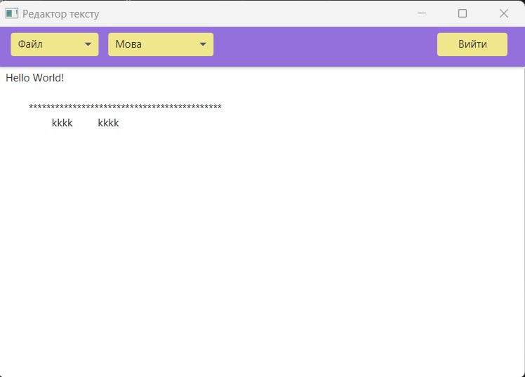
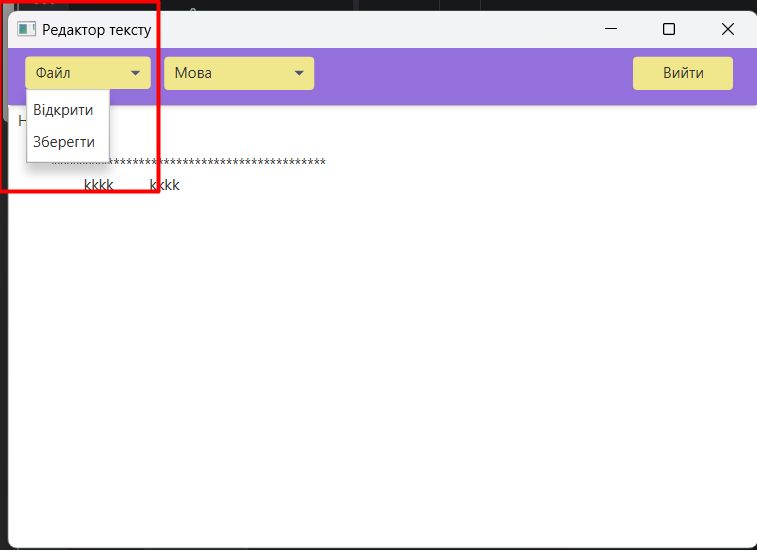
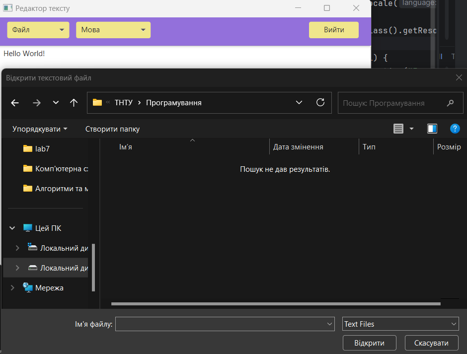
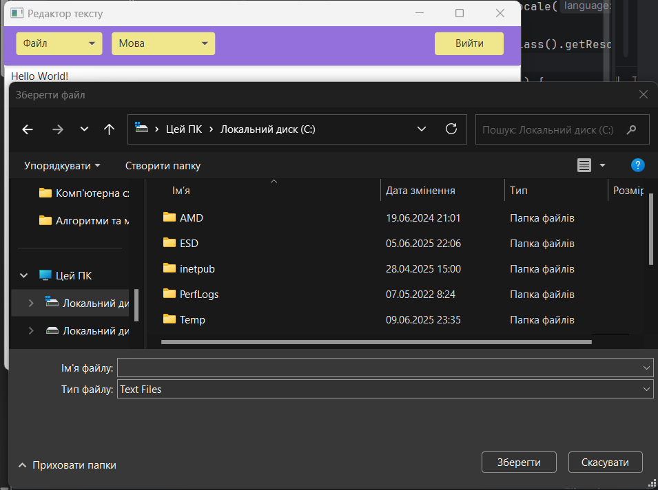
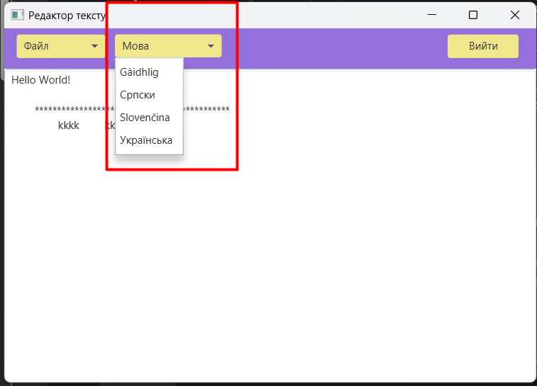
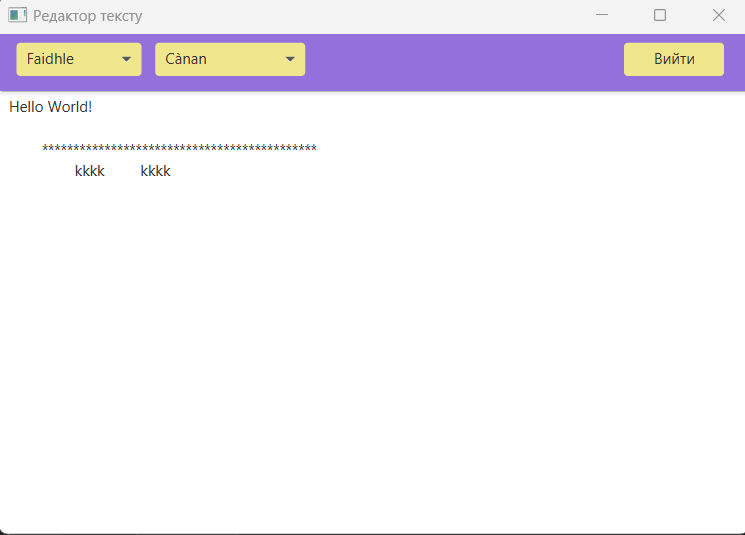

# Лабораторна робота 6
## Завдання:
###  Реалізувати простий текстовий редактор (з меню Файл (відкрити/зберегти/вийти) і полем редагування тексту)

## Початковий екран

## Випадне меню кнопки "Файл"

## Відкрити файл

## Зберегти файл

## Випадне меню кнопки "Мова"

## Переклад мови

